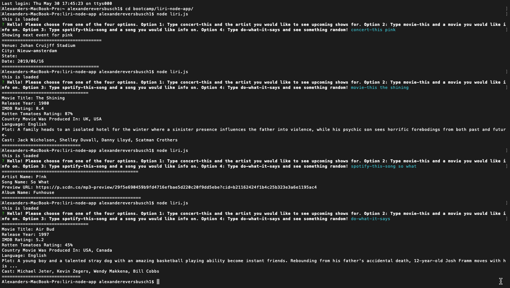

## liri-node-app

This app is a Language Interpretation and Recognition Interface built using Axios, Moment, DotEnv, and Inquirer NPMs. Liri uses the Node-Spotify-API, Bandsintown API, and OMDB API to find info on songs, bands, and movies

## Getting Started

* Run npm install to install the dependcies needed for this program. 

## Using Liri

* Start the app by typing node liri.js in your terminal
* Type any of the below example commands and recieve info on whatever artist, song, or movie you searched. 
* Do-what-it-says will randomly generate a command and input search value. 

## Built With

* [Axios](https://www.npmjs.com/package/axios)
* [Moment](https://www.npmjs.com/package/moment)
* [Node.js](https://nodejs.org/en/docs/)
* [DotEnv](https://www.npmjs.com/package/dotenv)
* [Inquirer](https://www.npmjs.com/package/inquirer)

## Example Searches
1. concert-this Metallica
2. movie-this Dunkirk
3. spotify-this-song All The Small Things
4. do-what-it-says 

## Video Walkthrough:
https://www.youtube.com/watch?v=XX3_4IANdlc&feature=youtu.be

## Screenshot
## Concert, Movie, Song, and Random Search Consecutively

## Authors

* **Alex Eversbusch** 

## Version

V1.0

